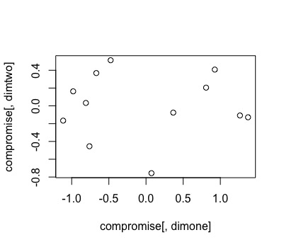

```{r, echo=FALSE}
mfa <- function(data, sets, ncomps = NULL, center = TRUE, scale = TRUE) {
  # Stop condition
  if (class(data)!="matrix" && class(data)!="data.frame") { 
    stop('data must be of class "matrix" or "data.frame"')
  }
  
  # remove NA's
  data = na.omit(data)
  
  # Populate "indices" with the groupings from the "sets" argument, and load into a dataframe
  indices = c()
  for (i in 1:length(sets)) {
    indices = c(indices, sets[[i]])
  }
  dat = data[,indices]
  
  # center and scale if requested
  if (scale) {
    if (center) {
      dat = scale(dat, center = TRUE, scale = FALSE)
      dat = apply(dat, 2 , function(x){x/sqrt(sum(x^2))})
    }
    else {
      dat = scale(dat, center = FALSE, scale = apply(dat, 2, sd, na.rm = TRUE))
    }
  }
  if (center) {
    dat = scale(dat, center = TRUE, scale = FALSE)
  }
  
  # Step 1: PCA of Each Data Table
  F_partial = list() # Empty list for partial factor
  a = c() # Empty list for alphas
  K = length(sets) # Empty list of length sets for Ks
  J = c() # Empty vector for Js
  index = 1 # Start index at 1
  for (i in 1:length(sets)) {
    
    # Break up data into each assessor
    Xi = dat[,index:(index+length(sets[[i]])-1)]
    J = c(J, length(sets[[i]]))
    
    # Compute SVD using the "svd" function in the base package
    SVD = svd(Xi) # Save results of svd on the table of assessors
    U = SVD$u # Pulls a matrix whose columns contain the left singular values
    D = diag(SVD$d) # Pulls a vector containing the singular values of x
    V = SVD$v # Pulls a matrix whose columns contain the right singular vectors of x
    
    # alpha weights
    alpha_1 = D[1,1]^-2 # Weight is equal to the reciprocal square
    a = c(a, rep(alpha_1,length(sets[[i]]))) # Populate a vector containing the weights for all of the sets

    # Partial factor scores (step 1)
    F_partial[[i]] = K*alpha_1*Xi # Take the K value, weight it, and multiply by each assessor's scores
    
    index = index + length(sets[[i]])
  } # Increment the index by the length of the sets
  
  # Step 2: Generalized SVD of X
  m = rep(1/dim(dat)[1], dim(dat)[1]) # Table of dimensions
  
  # Compute GSVD
  GSVD = svd(diag(m^(1/2)) %*% dat %*% diag(a^(1/2))) # Apply the constraints to the matrix decomposition, and return the GSVD
  Q = t(GSVD$v) %*% diag(a^(-1/2))  # factor loadings
  
  # Eigenvalues
  eigenvalues = GSVD$d^2 # Pulls the diagonal vector, and squares it (equal to the vector of eigenvalues)
  
  # Common Factor Scores
  F_common = dat %*% diag(a) %*% t(Q)
  
  # Partial Factor Scores (step 2)
  index = 1
  for (i in 1:length(sets)) {
    F_partial[[i]] = F_partial[[i]] %*% t(Q)[index:(index+length(sets[[i]])-1),]
    index = index + length(sets[[i]])
  } # Populate partial factor matrix
  
  # Extract number of requested components
  if (is.null(ncomps)) {
    ncomps = length(eigenvalues)
  }
  
  for (i in 1:length(F_partial)) {
    F_partial[[i]] = F_partial[[i]][,1:ncomps]
  }
  
  # Place the results into a list and set the class of the list as "mfa"
  res <- list(
    alpha_weights = a,  
    Jk = J,  
    eigenvalues = eigenvalues[1:ncomps],
    common_factor_scores = F_common[,1:ncomps],
    partial_factor_scores = F_partial,
    factor_loadings = t(Q)[,1:ncomps]
  )
  class(res) <- "mfa"
  
  return(res)
}
```

```{r, echo=FALSE, message=FALSE, warning=FALSE}
require(RCurl)
data <- read.csv(text=getURL('https://raw.githubusercontent.com/ucb-stat243/stat243-fall-2016/master/problem-sets/final-project/data/wines.csv'))
# Optionally, save the csv

# write.csv(data, file="wines.csv")
# Rename the columns

colnames(data) <- c("ID", "cat pee", "passion fruit", "green pepper", "mineral", "smoky", "citrus", "tropical", "leafy", "grassy", "flinty", "vegetal", "hay", "melon", "grass", "peach", "titratable acid", "pH", "alcohol", "res_sugar")

arrays <- list(c(2:7), c(8:13), c(14:19), c(20:24), c(25:30), c(31:35), c(36:39), c(40:45), c(46:50), c(51:54))

# Test the function and save the result
winescores <- mfa(data, arrays)
```
## Wine Tasting Experiment

- The dataset deals with expert assessors tasting 12 wines from Sauvignon Blanc grapes
    - **Three wine regions**: France, Canada, New Zealand
    - Four wines per region
- 10 experts
    - 9 point scale (1 weakest to 9 strongest)
    - 4 variables
        - Cat Pee
        - Passion Fruit
        - Green Pepper
        - Mineral
    - Additional Variables that the Assessors Added
        - Smoky, Citrus, Tropical, Leafy, Grassy, Flinty, Vegetal, Hay, Melon, Grass, Peach

## Wine Tasting Experiment (cont.)

- Other Descriptive Variables
    - Acidity: “Total acidity tells us the concentration of acids present in wine whereas the pH level tells us how intense those acids taste. For example, if you have a wine with 6 g/l total acidity and a pH of 3.2 it will taste more acidic than a wine with 4 g/l total acidity with the same pH level” [@:BDKrEnJ2] 
    - pH: Measured ripeness in relation to acidity; low (expected taste: tart, crisp) to high pH (susceptible to bacteria); average pH 3-4, with white wines on the lower end of the spectrum, and red wines on the higher end of that range (Wine Spectator)
    - Alcohol: Alcohol by volume (ABV), measured as the number of milliliters of pure ethanol / 100 milliliters of solution at 20 C; expressed in %
    - Residual Sugar: The sugar that’s remaining after fermentation stops (g/L)

## Analysis Techniques 

- Principle component analysis (PCA): a statistical procedure that uses orthogonal transformation to convert a set of observations of possibly correlated variables into a set of linearly uncorrelated variables (principle components)

-	Multifactor analysis (MFA) originated with French statisticians Brigitte Escofier and Jerome Pages ~ 1980
  - Initially, MFA was a response or generalization of PCA
  - It has a number of goals:
    - analyze several data sets measured on the same observation
    - provide a set of common factor scores (compromise factor scores)
    - project each of the original data sets onto the compromise to analyze communalities and discrepancies

## PCA vs. MFA

  -	MFA is part of the PCA family and hence its main analytical tool is SVD and GSVD
  - In MFA, like PCA, the importance of a dimension (ie principle component) is reflected by its eigenvalue which indicates how       much of the total inertia (variance) of the data is explained by this component 
  
## Multifactor Analysis: Steps and Outcomes

- Steps of MFA: 
  1.	A PCA of each data table is performed and the first singular value of each table recorded
  2.	A grand matrix is created by concatenating all the data tables and a non-normalized general PCA is performed by decomposing       the grand matrix with a GSVD where the column weights are obtained from the first (squared) singular value of each data           table 
  3.	The observation partial factor scores for each table are computed by projecting each data table onto the common space 
- Dervied Outputs of MFA
  - Summarized information about the obtained **eigenvalues** (“explained inertia”)
  
## Contributions
- **Contributions**, a series of descriptive statistics that allow us to interpret how the following contribute to the extracted              dimensions:
      1. observations
          $$
          ctr_{i,l} = \frac{m_{i}*f^2_{i,l}}{\lambda_{l}}
          $$
      2. the variables 
          $$
          ctr_{j,l} = a_{j}*q^2_{j,l}
          $$
      3. the tables
          $$
          ctr_{k,l} = \sum{_{j}^{J_{k}}ctr_{j,l}}
          $$
  
## Sample Code + Plots
  
- The basic idea behind all three of these contribution measures is to weight each assessor's contribution to the overall score
    - Contributions range from [0,1]
    - Contributions sum to 1
    - The larger the contribution, the more weight it has in explaining the overall score
- Essentially, the MFA method takes a series of blocked observations, standardizes them, and reports them in a simple vectorized weight format
- Below, we'll provide some snippets from the code to carry out these steps.  Full code, with comments, is available in the package

## Step One: PCA of Each Data Table

```{r, eval=FALSE}
# Step 1: PCA of Each Data Table
F_partial = list() # Empty list for partial factor
a = c() # Empty list for alphas
K = length(sets) # Empty list of length sets for Ks
J = c() # Empty vector for Js
index = 1 # Start index at 1
for (i in 1:length(sets)) {
# Break up data into each assessor
Xi = dat[,index:(index+length(sets[[i]])-1)]
J = c(J, length(sets[[i]]))
1
# Compute SVD using the "svd" function in the base package
SVD = svd(Xi) # Save results of svd on the table of assessors
U = SVD$u # Pulls a matrix whose columns contain the left singular values
D = diag(SVD$d) # Pulls a vector containing the singular values of x
V = SVD$v # Pulls a matrix whose columns contain the right singular vectors of x
# alpha weights
alpha_1 = D[1,1]^-2 # Weight is equal to the reciprocal square
a = c(a, rep(alpha_1,length(sets[[i]]))) # Populate a vector containing the weights for all of the sets
# Partial factor scores (step 1)
F_partial[[i]] = K*alpha_1*Xi # Take the K value, weight it, and multiply by each assessor's scores
index = index + length(sets[[i]])
} # Increment the index by the length of the sets
```

## Step Two: Grand Matrix for GSVD

```{r, eval=FALSE}
= rep(1/dim(dat)[1], dim(dat)[1]) # Table of dimensions
# Compute GSVD
GSVD = svd(diag(m^(1/2)) %*% dat %*% diag(a^(1/2))) # Apply the constraints to the matrix decomposition, Q = t(GSVD$v) %*% diag(a^(-1/2)) # factor loadings
```

## Step Three: Partial Factor Scores

```{r, eval=FALSE}
# Partial Factor Scores (step 2)
index = 1
for (i in 1:length(sets)) {
F_partial[[i]] = F_partial[[i]] %*% t(Q)[index:(index+length(sets[[i]])-1),]
index = index + length(sets[[i]])
```

## Sample Plot: Common Factor Score

- After running the package and the associated auxillary print and plot functions, we can plot individual elements from the mfa object
- Below is an example of a plot of the 1st and 2nd columns from the compromise score table


      
## RV Coefficient  + Lg Coefficient

- Used to evaluate the similarity between two tables 
    - In other words, this can be interpreted as a noncentered squared coefficient of correlation between two matrices; it reflects     the amount of variance shared by two matrices 
    - Varies between 0 – 1
- Lg Coefficient 
    - Reflects MFA normalization and takes positive values 

## Bootstrapping 
- Used to estimate the stability of the compromise factor scores 
- The stability of the descriptive statistics (i.e. contributions of observations, variables, and tables to a dimension) can be     determined with boostrapping, which is a cross validation technique whose results can be used to select the relevant elements of   a dimension 

## Shiny App
- We implemented the package in a Shiny app interface
- The app provides a dropdown menu in which the user can specify whether they would like to plot the eigenvalues, common factor scores, partial factor scores, or factor loadings
    - If the user chooses one of the latter three options, they can further specify which columns to plot

## Bibliography 

- Vinny, D. (2016). "Ask Dr. Vinny." from http://www.winespectator.com/drvinny/show/id/5035.
	
- Abdi, H., et al. (2013). "Multiple factor analysis: principal component analysis for multitable and multiblock data sets." Wiley Interdisciplinary reviews: computational statistics 5(2): 149-179.
	
- (2015). "Understanding Acidity in Wine." from http://winefolly.com/review/understanding-acidity-in-wine/.
	

